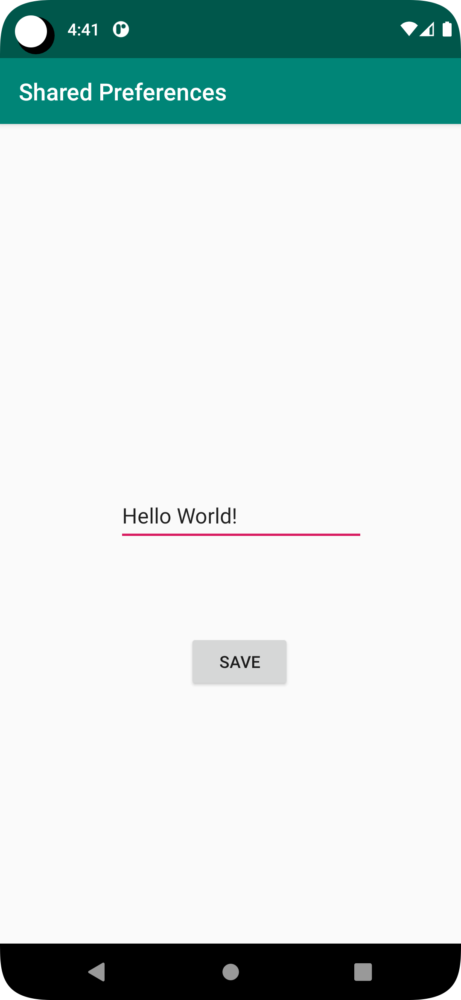
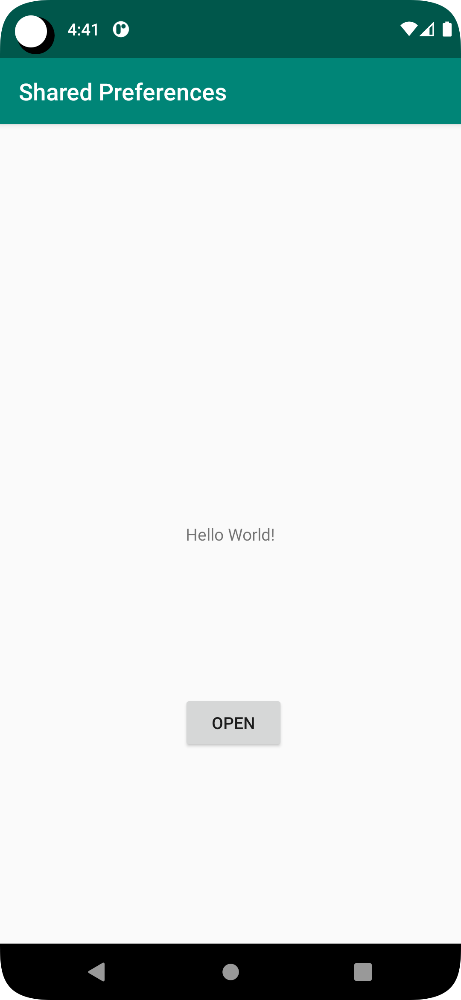

# Rapport

Den här uppgiften handlade om att först öppna SecondActivity från MainActivity,
därefter skriva data i SecondActivity och få datan att visas upp i MainActivity.
Detta är löst genom att använda Shared Preferences.

Knapp för att öppna SecondActivity från MainActivity
```
Button open = findViewById(R.id.button);

open.setOnClickListener(new View.OnClickListener() {
    @Override
    public void onClick(View view) {
        Intent intent = new Intent(MainActivity.this, SecondActivity.class);
        startActivity(intent);
    }
});
```

Knapp för att skriva data till Shared Preferences med EditText och avsluta SecondActivity
```
Button save = findViewById(R.id.button2);

save.setOnClickListener(new View.OnClickListener() {
    @Override
    public void onClick(View view) {
        preferences = getSharedPreferences("preferences", MODE_PRIVATE);
        SharedPreferences.Editor edit = preferences.edit();

        text = findViewById(R.id.editText);

        edit.putString("text", text.getText().toString());
        edit.apply();

        finish();
    }
});
```

Läser data från Shared Preferences och visar data i TextView
```
protected void onResume() {
    super.onResume();

    preferences = getSharedPreferences("preferences", MODE_PRIVATE);
    String string = preferences.getString("text", "Empty");

    text = findViewById(R.id.textview);
    text.setText(string);
}
```


